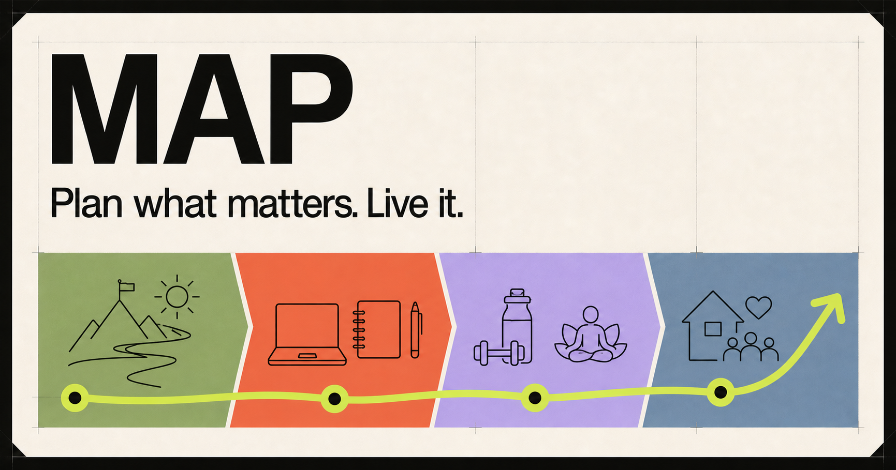
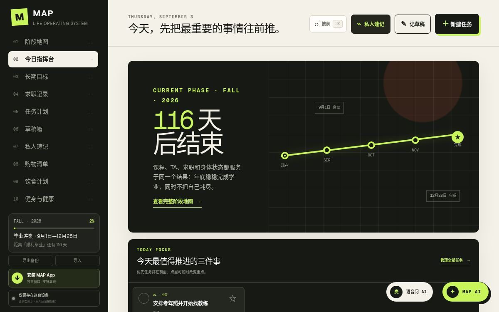
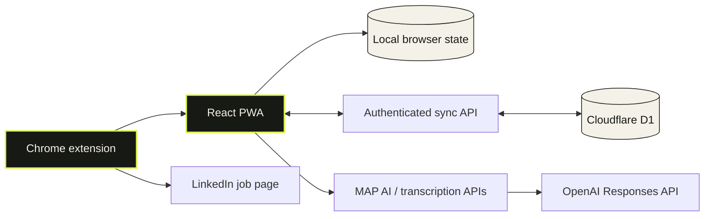

<p align="center">
  
</p>

<h1 align="center">MAP Life OS</h1>

<p align="center">
  <strong>My Action Plan — a local-first operating system for turning long-term goals into daily action.</strong>
</p>

<p align="center">
  Goals · calendar · tasks · career · notes · meals · shopping · fitness · AI
</p>

<p align="center">
  
  
  
  
  
</p>



MAP is not another disconnected collection of to-do lists. It keeps the full execution chain in one system:

```text
Long-term direction → current phase → weekly rhythm → today's actions → actual results
```

Plans stay editable, real life is allowed to deviate, and AI can propose changes without silently rewriting your data. The app is designed to be used every day—not merely demonstrated once.

## The product



<p align="center"><sub>Real desktop UI from the running product. MAP also ships with a dedicated touch-first mobile layout.</sub></p>

| System | What it does |
| --- | --- |
| **Goals & phases** | Rank long-term goals, define the current life phase, and connect execution back to an outcome. |
| **Calendar & planning** | Weekly and monthly views, recurring routines, ranged tasks, drag-to-reschedule, completion, rollover, and undo. |
| **Career CRM** | Track applications across Applied, Interview, Offer, and Rejected; filter by date; inspect application activity and funnel history. |
| **Notes with intent** | Separate unscheduled backlog, long-form ideas, and frequently reused private reference notes instead of forcing everything into tasks. |
| **Fitness & health** | Flexible weekly training plans, actual activity logs, exercise technique notes, working-weight history, nutrition check-ins, and progress trends. |
| **Meals & shopping** | Pick meal themes for the week, open recipes, distinguish groceries from ready-made meals, generate a reviewed shopping list, and manage purchase intent. |
| **MAP AI** | A contextual chat assistant that can analyze the system or propose precise data changes with a before/after preview and undo path. |
| **Offline & sync** | Installable PWA, complete offline working copy, authenticated D1 synchronization, and conflict-aware merging when devices reconnect. |

## Built around reality, not streak anxiety

MAP deliberately separates **plans** from **what actually happened**. A two-hour hike can replace a planned gym session without corrupting the reusable weekly template. Rest days, skipped sessions, moved tasks, incomplete days, and changing priorities are normal states—not failures that break a streak.

The same principle shapes the rest of the product:

- a task can exist without pretending it already has a date;
- recurring work can happen every day or at a configurable interval;
- completed items leave crowded calendars but remain available in historical views;
- private notes stay local unless a user explicitly opts an individual note into sync and AI context;
- every AI mutation is a proposal first, never an invisible write.

## Key workflows

### Plan from direction to today

1. Rank the goals that matter now.
2. Define a time-bounded phase and its desired outcome.
3. Add fixed commitments, recurring rhythms, and flexible tasks.
4. Use the week and today views to decide what deserves attention next.

### Capture without organizing first

1. Drop a small unscheduled item into the backlog, or open a full-page idea note.
2. Type offline or dictate a longer thought for online transcription.
3. Promote an item into a scheduled task only when it is ready.
4. Ask MAP AI to restructure a note, then inspect the full revision before accepting it.

### Track health without making the plan brittle

1. Keep a reusable weekly training template.
2. Start the planned workout or record any activity that actually happened.
3. Log sets, reps, weight, unit, RIR, duration, distance, and notes as needed.
4. Review exercise history and working-weight trends without treating rest as missing data.

### Turn job browsing into a pipeline

1. Open a LinkedIn job and capture it with the included Chrome extension.
2. Preview the extracted company, role, location, URL, and description—or save directly after checking them.
3. Move the application through the board and keep stage history.
4. Reuse a local autofill profile for repetitive application fields and ordered work experience.

## Architecture



MAP uses one domain model across the UI, offline cache, sync layer, and AI operation schema. The assistant does not edit arbitrary DOM or prose and hope the app catches up—it proposes typed operations against the same records the product already understands.

## Privacy model

| Data | Default location | Sent to AI? |
| --- | --- | --- |
| Goals, tasks, schedule, career, meals, shopping, and fitness | Browser copy; authenticated D1 sync in the hosted app | Only when the user sends a MAP AI message |
| Private reference notes | **Current device only** | No, unless that individual note is explicitly marked **AI-readable · cloud sync** |
| Idea-note voice recording | In memory while transcribing | Audio is sent only for the requested transcription and is not stored by MAP |
| Job-application autofill profile | `chrome.storage.local` inside the extension | Never; deterministic autofill uses no AI tokens |
| OpenAI API key | Local environment or hosted runtime secret | Never exposed to browser code |

MAP AI receives only the context needed for the current conversation. Proposed writes are reduced to relevant collections, displayed as a preview, and applied only after confirmation. Sensitive autofill categories—passwords, SIN/SSN, birth date, demographic answers, salary, signatures, banking fields, and file uploads—remain manual.

## Run locally

### Requirements

- Node.js **22.13+**
- npm
- An OpenAI API key only if MAP AI and voice transcription are needed

```bash
git clone https://github.com/weifanwu/plan.git
cd plan
npm install
cp .env.example .env.local
npm run dev
```

Open [http://localhost:3000](http://localhost:3000). The planning system works without an API key; add `OPENAI_API_KEY` to `.env.local` to enable MAP AI and transcription.

### Install as an app

Open MAP in a compatible desktop or mobile browser and choose **Install app / Add to Home Screen**. The service worker caches the application shell, so existing data can still be viewed and edited offline; AI and cross-device synchronization resume after the connection returns.

## Chrome extension

The repository includes [`extension/`](./extension), a Manifest V3 companion for two expensive job-search workflows:

- **Job Capture** reads the currently selected LinkedIn posting, follows LinkedIn SPA URL changes, and sends a validated draft to MAP.
- **Application Autofill** uses a device-local profile to fill empty contact, education, authorization, and multi-entry work-experience fields. Access is requested per recruiting site; existing values and submit buttons are left untouched.

Install it locally:

1. Open `chrome://extensions`.
2. Enable **Developer mode**.
3. Choose **Load unpacked**.
4. Select this repository's `extension` directory.

See the complete [extension guide](./extension/README.md) for capture, direct-save, permission, and autofill behavior.

## Technology

- **UI:** React 19, TypeScript, CSS, Vinext
- **Runtime:** Cloudflare Workers-compatible ESM
- **Persistence:** local browser storage + Cloudflare D1 / SQLite schema
- **Offline:** service worker + installable web app manifest
- **AI:** OpenAI Responses API with structured, preview-first operations
- **Extension:** Chrome Manifest V3, side panel, optional per-origin permissions
- **Quality:** Node test runner, ESLint, production builds, and regression coverage for sync, scheduling, retention, AI scope, responsive workflows, and extension safety

## Project structure

```text
app/                  Product UI and feature modules
lib/                  Scheduling, sync, analytics, fitness, meal, and AI logic
worker/               Cloudflare Worker APIs for sync, AI, and transcription
db/ + drizzle/        D1 schema and migrations
extension/            LinkedIn capture and application autofill extension
public/               PWA manifest, service worker, icons, and brand assets
tests/                Product, integration, and regression tests
```

## Validation

```bash
npm test       # production build + complete test suite
npm run lint   # source and extension linting
npm run build  # production bundle
```

## Contributing

Focused issues and pull requests are welcome. Please preserve MAP's core constraints: local-first behavior, explicit privacy boundaries, flexible plans, mobile and desktop parity, recoverable destructive actions, and preview-first AI mutations.

When changing scheduling or sync behavior, add a regression test for the exact state transition—not only the visible UI result.
